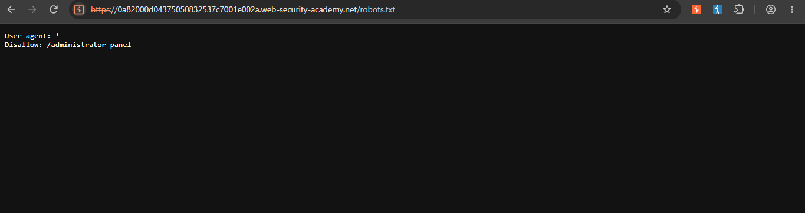
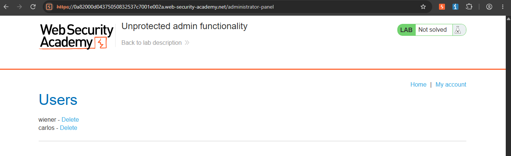
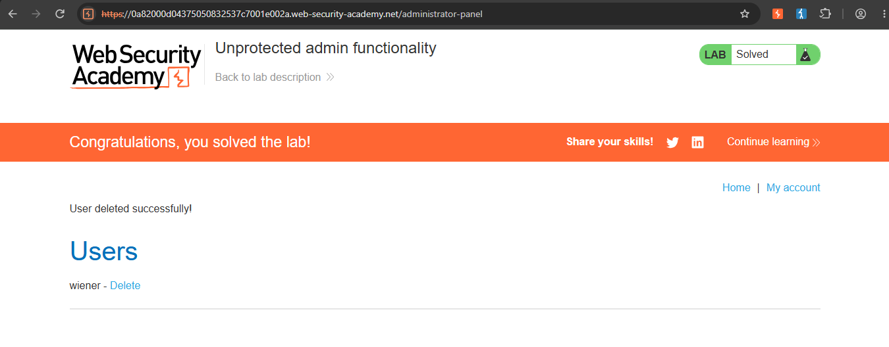

Unprotected Admin Functionality — Disclosed via robots.txt (PortSwigger Web Security Academy)

Lab: [Unprotected admin functionality](https://portswigger.net/web-security/access-control/lab-unprotected-admin-functionality)
Category: Broken Access Control
Difficulty: Apprentice
Status: Solved
Tools used: Web browser (no Burp needed for this one)

Objective
Access the admin panel without authentication and delete the user `carlos`.

Hypothesis
`robots.txt` isn't a security control — it's just a public text file that tells search engine crawlers which paths not to index.
It can't actually block access to anything; it only lists paths. So checking it seemed like a reasonable way to find directories the site didn't want indexed (and possibly didn't want found at all), even though it has no way of enforcing that.

 Steps

1. Check robots.txt
Navigated to `<lab-url>/robots.txt` and found a `Disallow` entry pointing to the admin panel's path.

   

2. Access the disclosed path directly
Replaced the URL path with the disclosed admin panel path and loaded it directly in the browser. The admin panel loaded fully, with no login prompt — `carlos` was visible in the user list, and the lab was still marked "Not solved."

3. Delete the user
Used the admin panel's delete function to remove `carlos`. The lab immediately updated to "Solved."

      

Root Cause
The admin panel had no authentication or authorization check in place at all — no login page, no session/role verification. The only thing standing between an anonymous visitor and full admin functionality was the fact that its URL wasn't linked anywhere on the site. That "protection" broke down because `robots.txt` is a publicly readable file, and its entire purpose is to list paths in plain text — so the developers effectively announced the hidden path to anyone who checked it.

This is a textbook case of security through obscurity: hiding something instead of actually restricting access to it. Obscurity can slow down casual discovery, but it is not a substitute for real access control.

 Fix Recommendations
- Require authentication (login) for any admin functionality, regardless of how "hidden" the URL is.
- Enforce role-based authorization server-side — even a logged-in non-admin user should not be able to reach admin actions.
- Never rely on an unguessable or unlinked URL as a security boundary; assume any URL can eventually be discovered.
- Avoid listing sensitive paths in `robots.txt` — if a path shouldn't be public, it shouldn't appear anywhere in a publicly accessible file.
