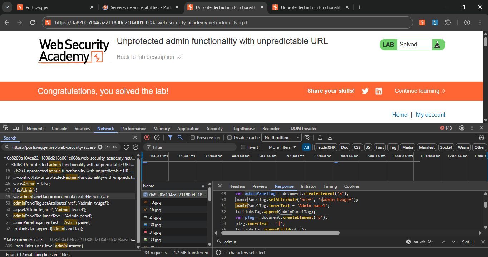
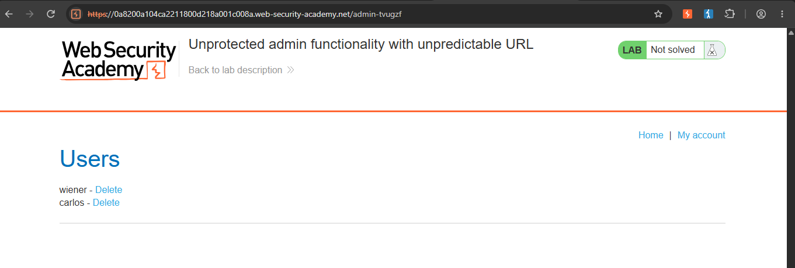
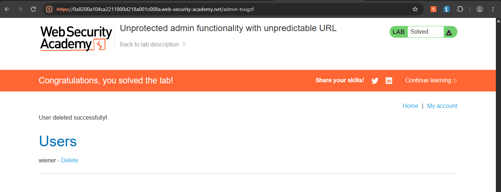

 Unprotected Admin Functionality — Disclosed via Page Source (PortSwigger Web Security Academy)

Lab: [Unprotected admin functionality with unpredictable URL](https://portswigger.net/web-security/learning-paths/server-side-vulnerabilities-apprentice/access-control-apprentice/access-control/lab-unprotected-admin-functionality-with-unpredictable-url)
Category: Broken Access Control
Difficulty: Apprentice
Status: Solved
Tools used: Browser DevTools (Sources / view page source)

 Objective
Find the unpredictable, unlinked admin panel URL and use it to delete the user `carlos`, without any credentials.

 Hypothesis
JavaScript and HTML both run and render entirely in the browser, which means everything written into them — including a link intended to stay hidden — is fully visible to anyone who checks the page's raw source or DevTools. Since the admin panel's URL wasn't guessable and wasn't shown as a visible link anywhere on the page, the actual path still had to exist somewhere in the code for the browser to reference it. Checking the page source was a logical way to find a path the developers didn't intend regular visitors to see.

 Steps

 1. Inspect the page source
Reviewed the lab home page's raw HTML/JavaScript using the browser's DevTools. Found an `<a href="...">` link pointing to the admin panel's path. This link was present in the code but not rendered as a visible, clickable element on the page itself.

 2. Navigate to the disclosed path
Copied the disclosed path from the `href` and loaded it directly in a new browser tab. The admin panel loaded fully, with no login prompt — `carlos` was still listed, and the lab was still marked "Not solved."

 3. Delete the user
Used the admin panel's delete function to remove `carlos`. The lab updated to "Solved."

 Root Cause
The admin panel's link existed in the page's HTML but was hidden from normal view rather than rendered visibly. The developers relied on the URL being unpredictable and not visibly linked as the only barrier to entry — but all client-side code, whether visually rendered or not, is fully readable by anyone who inspects the page. As with the `robots.txt`-disclosed version of this vulnerability, there was still no actual authentication or authorization check on the admin panel itself once its URL was known — the "unpredictable URL" was the only thing standing in the way, and it wasn't actually unpredictable to anyone willing to look at the source.

 Fix Recommendations
- Require authentication (login) for all admin functionality, independent of how obscure or unlinked the URL is.
- Enforce server-side role/permission checks on every admin action, not just on the page load.
- Never embed sensitive paths in client-side code (HTML/JS) if they are meant to remain hidden — anything sent to the browser can be read by the user.
- Treat "unpredictable URL" as no protection at all once any part of that URL is exposed anywhere the client can read it.
