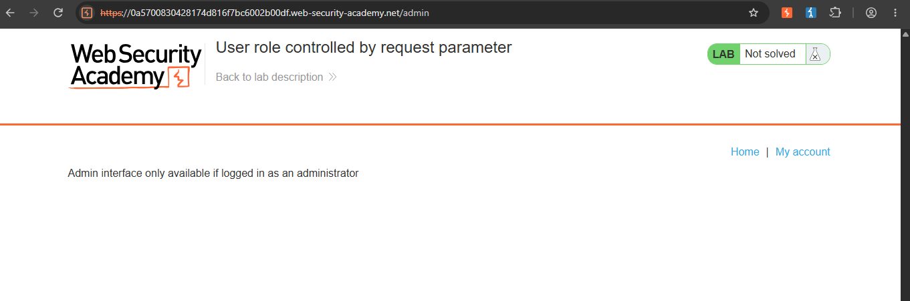
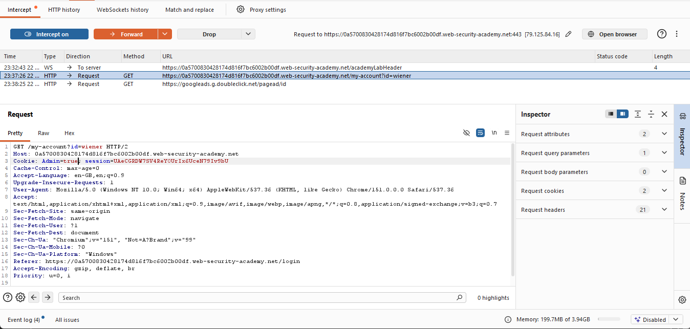
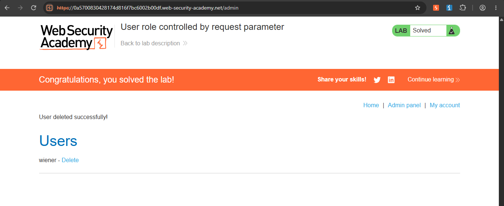

Broken Access Control — User Role Controlled by Forgeable Cookie (PortSwigger Web Security Academy)

Lab: [User role controlled by request parameter]
(https://portswigger.net/web-security/learning-paths/server-side-vulnerabilities-apprentice/access-control-apprentice/access-control/lab-user-role-controlled-by-request-parameter)
Category: Broken Access Control
Difficulty: Apprentice
Status: Solved
Tools used: Burp Suite Community Edition (Proxy, response interception)

Objective
Access the admin panel at `/admin` and delete the user `carlos`, using only the low-privileged credentials `wiener:peter`.

Hypothesis
After logging in as a normal user, the server needs some way to remember whether that user is an admin or not.
If that "admin status" is stored somewhere the client can see — such as a cookie — it's worth testing whether the client can also
edit it, and whether the server actually re-verifies that value or just blindly trusts whatever the browser sends back.

Steps

 1. Confirm no access as a normal user
Attempted to visit `/admin` without being logged in as an admin. Access was denied.

   

 2. Log in and intercept the response
Logged in with `wiener:peter`. Using Burp Proxy with response interception enabled, intercepted the server's response to the login request and found:
```
Set-Cookie: Admin=false
```
This confirmed the server communicates admin status to the browser via a plain, client-visible cookie.

 3. Modify the cookie
Edited the intercepted response, changing the cookie value from `Admin=false` to `Admin=true`, then forwarded it to the browser.

   

 4. Access the admin panel and delete the user
With the browser now holding `Admin=true`, loaded `/admin` — access was granted. Deleted the user `carlos` successfully.

   

 Root Cause
The server determined whether a user was an admin by reading a cookie (`Admin=true`/`false`) that the client controls. Cookies are stored and sent by the browser, and anyone can intercept and modify them before they reach the server. By simply changing the cookie's value, it was possible to self-assign admin privileges — the server accepted this claim without independently verifying it against the user's actual role (e.g. checked server-side, tied to the authenticated session).

This differs from a vulnerability like path traversal, which exploits unsanitized input. This is a case of the server trusting client-supplied data to make an authorization decision — effectively letting the user report their own permission level instead of the server verifying it itself.

 Fix Recommendations
- Never determine a user's role or permissions from any value the client can read or modify (cookies, hidden form fields, request parameters).
- Store role/permission state server-side, tied to the authenticated session, and verify it on every privileged request.
- Treat all client-supplied data as untrusted by default, especially anything related to identity or authorization — the client should never be the source of truth for "who am I" or "what am I allowed to do."
