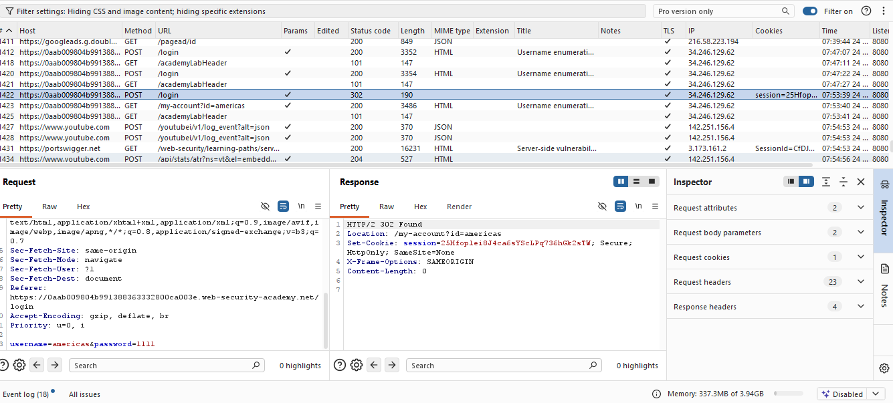
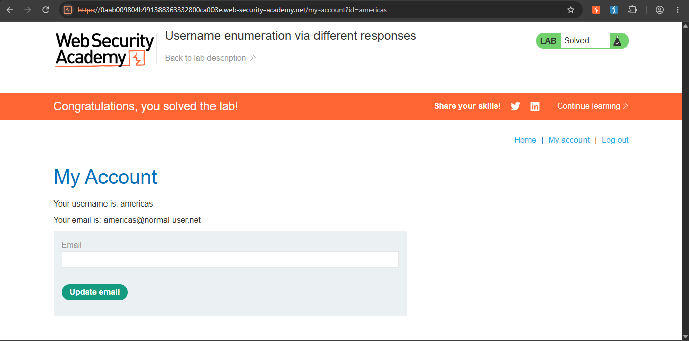

Authentication — Username Enumeration via Error Messages + Password Brute-Force (PortSwigger Web Security Academy)

Lab: Username enumeration via different responses
Category: Authentication
Difficulty: Apprentice
Status: Solved
Tools used: Burp Suite Community Edition (Proxy, Intruder)

Objective
Identify a valid username and its password through brute-force, then log in to solve the lab.

Hypothesis
A well-built login page should return the exact same generic error message regardless of whether the submitted username or password 
was wrong (e.g. "Invalid username or password") — this prevents an attacker from learning anything about which part of their guess was 
correct. If the app instead returns different messages depending on which part was wrong, it becomes possible to enumerate valid 
usernames one at a time, before even attempting to guess a password.

Steps

1. Submit an invalid login and observe the baseline response
Submitted a clearly invalid username and password. The response returned the message `"Invalid username"`.

2. Enumerate valid usernames with Burp Intruder
Sent the login request to Intruder, marked the `username` parameter as the payload position, and loaded a candidate username
wordlist (provided by the lab) as a Simple List payload. Ran a Sniper attack against all candidates with a static, invalid password.

Sorted the results by response Length. Nearly every response had an identical length — except one, which was 2 bytes longer. 

Checking that response confirmed it returned `"Incorrect password"` instead of `"Invalid username"`.

This difference in message (and therefore in response length) revealed that the corresponding username — `americas` — exists in 
the application's database, even though the password used was still wrong.

2. Brute-force the password
With a confirmed valid username, cleared the previous payload position and instead marked the `password` parameter. Loaded the 
lab's candidate password wordlist and ran the attack again, keeping `username=americas` static.

Sorted the results by Status code. Every request returned `200` (login page re-rendered with an error) except one, which 
returned `302` (a redirect) — the signature of a successful login, since the server redirects the user to their account page afterward.

3. Log in and confirm
Logged in using `americas` and the identified password. Lab marked as solved.

Root Cause
This vulnerability had two separate, compounding causes:

1. Username enumeration via inconsistent error messages. The login endpoint returned a different message depending on whether the 
username specifically was valid (`"Incorrect password"`) versus entirely unrecognized (`"Invalid username"`). This let an attacker
determine which usernames exist in the system without ever needing a correct password — simply by observing which message 
(and resulting response length) came back for each guess.

2. No rate limiting or account lockout on login attempts. Once a valid username was known, the server allowed unlimited password 
guesses in rapid succession with no throttling, CAPTCHA, or lockout after repeated failures. This made brute-forcing the password for a 
known username entirely feasible.

Neither issue alone would be as severe — inconsistent error messages without unlimited attempts would slow an attacker down 
significantly, and unlimited attempts without a valid username to target would require guessing both username and password 
simultaneously (a much larger search space). Together, they made full account compromise straightforward.

 Fix Recommendations
- Return an identical, generic error message (and ideally an identical response time/length) for both "invalid username" and "invalid 
  password" cases — never indicate which part of the credentials was wrong.
- Implement rate limiting and/or account lockout after a reasonable number of failed login attempts, per account and/or per source IP.
- Consider CAPTCHA or progressive delays after repeated failures to further slow automated brute-force attempts.
- Monitor and alert on abnormal volumes of failed login attempts against a single account or from a single source.
