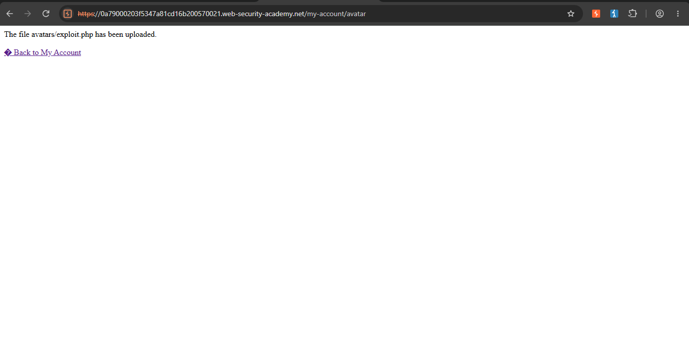
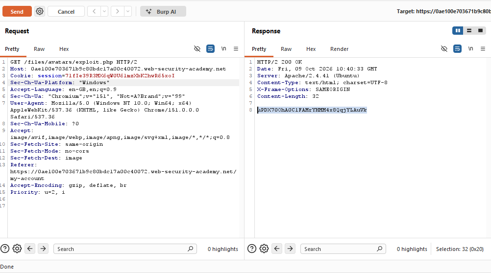
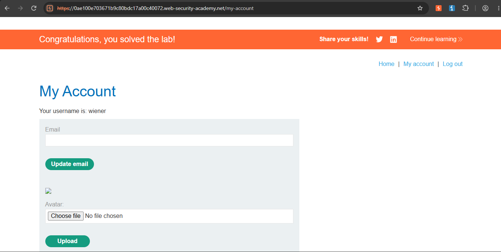

File Upload — Remote Code Execution via Web Shell (PortSwigger Web Security Academy)

Lab: Remote code execution via web shell upload
Category: File Upload Vulnerabilities
Difficulty: Apprentice
Status: Solved
Tools used: Burp Suite Community Edition (Proxy, Repeater), a locally-created PHP file

Objective
Exploit the avatar upload feature to upload a web shell and use it to read the contents of `/home/carlos/secret`, solving the lab.

Hypothesis
The avatar upload feature accepted standard image files (e.g. `.jpg`). It's worth testing whether the server actually 
validated the file type based on content, or only trusted the file extension — and if so, whether it would also accept a file 
extension it shouldn't, such as `.php`.

Steps

1. Confirm the upload mechanism
Logged in and uploaded a normal image as an avatar. Found the corresponding request in Burp's HTTP history:
```
GET /files/avatars/<filename>
```
confirming uploaded files are served back from a predictable, consistent path.

2. Create a malicious PHP file
Created a local file, `exploit.php`, containing a simple web shell:
```php
<?php echo file_get_contents('/home/carlos/secret'); ?>
```
This script reads and outputs the contents of a target file on the server when executed.

3. Upload the PHP file via the avatar feature
Used the same avatar upload function to upload `exploit.php` in place of a real image. The server accepted the upload without
rejecting the `.php` extension.



4. Request the uploaded file directly
Using Burp Repeater, sent a request to the uploaded file's path:
```
GET /files/avatars/exploit.php HTTP/1.1
```
The response contained the contents of `/home/carlos/secret` — the server had executed the PHP script rather than simply returning
it as a static file.



5. Submit the secret
Submitted the retrieved secret to solve the lab.



Root Cause
The avatar upload feature accepted files with a `.php` extension, without restricting uploads to safe image file types
(e.g. by validating actual file content/MIME type, not just the filename). Because uploaded files are 
stored in `/files/avatars/` — a location the web server treats as executable — simply requesting the uploaded file's URL 
caused the server to run the PHP code inside it, rather than returning it as a plain downloadable file. 
This combination (no file type validation + executable storage location) allowed a malicious script — effectively a basic 
web shell — to be uploaded and run on the server, resulting in remote code execution.

 Fix Recommendations
- Validate uploaded files by actual content/type (e.g., verifying image file signatures), not just by filename extension.
- Maintain an allowlist of permitted file extensions for uploads, rejecting anything outside it.
- Store uploaded files in a location the web server is configured not to execute (e.g., outside the webroot, or in a directory with execution explicitly disabled).
- Consider renaming uploaded files to a generated, non-predictable name to prevent direct targeting even if a bad file is accepted.
